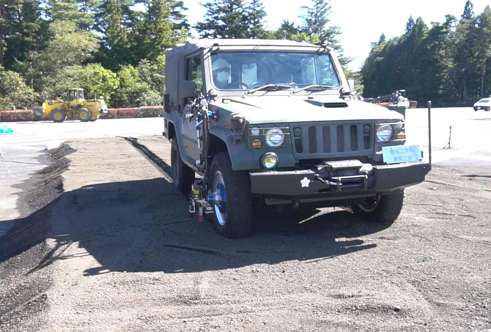
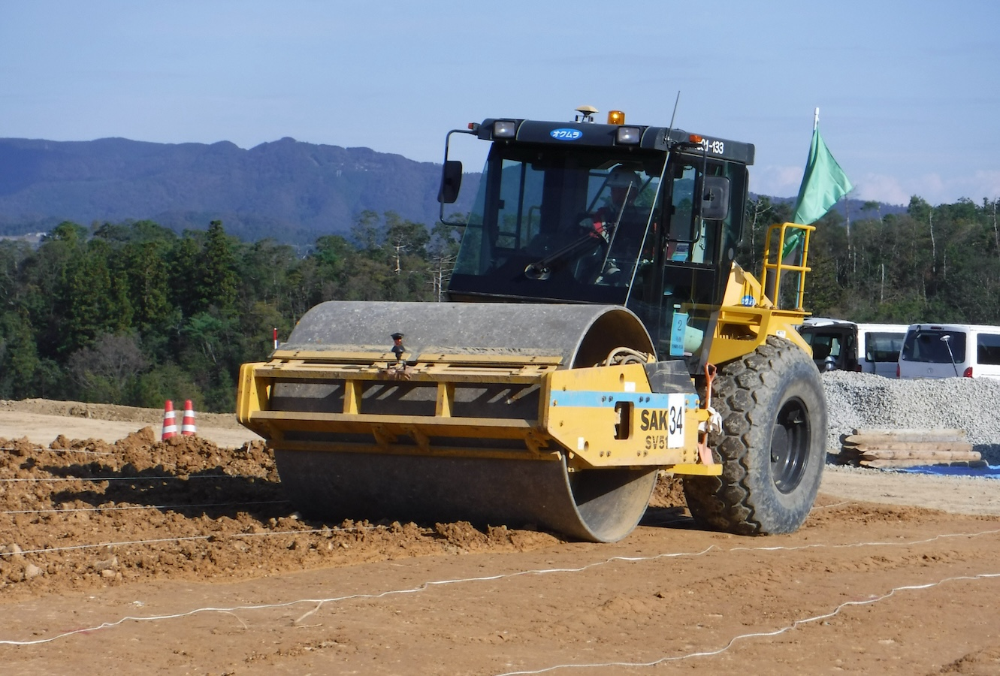
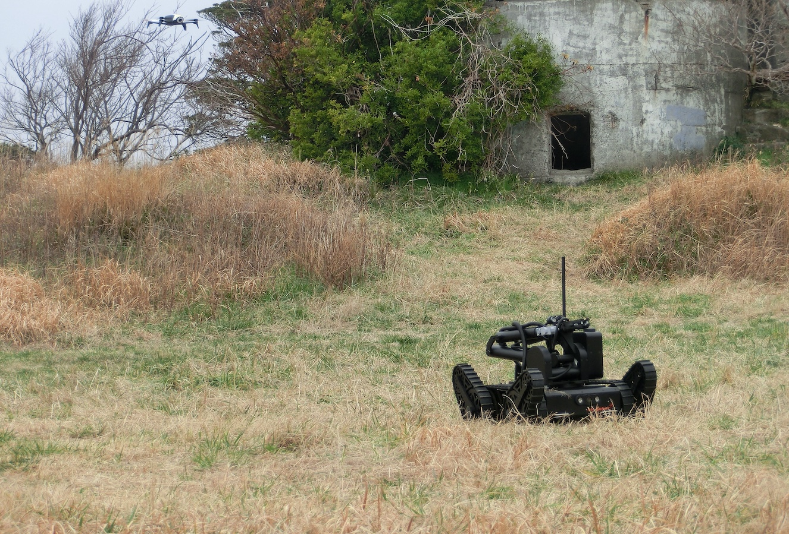
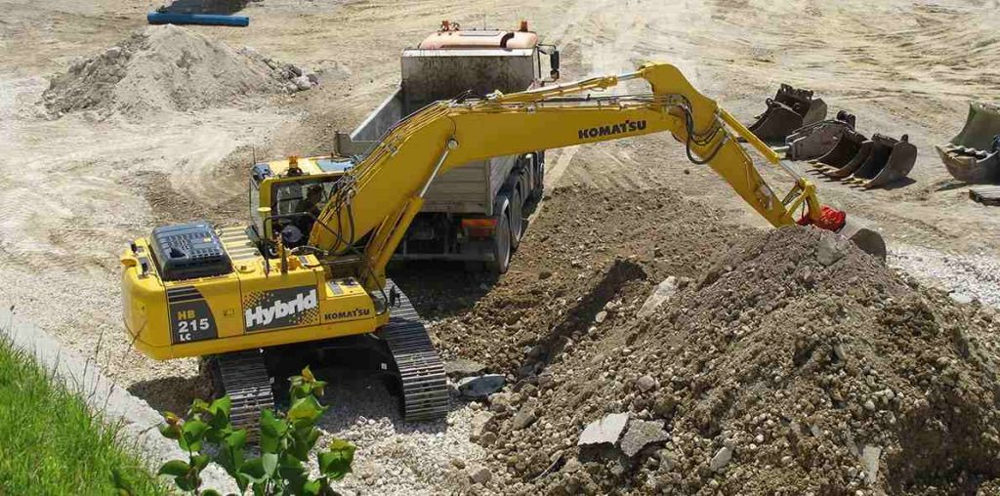
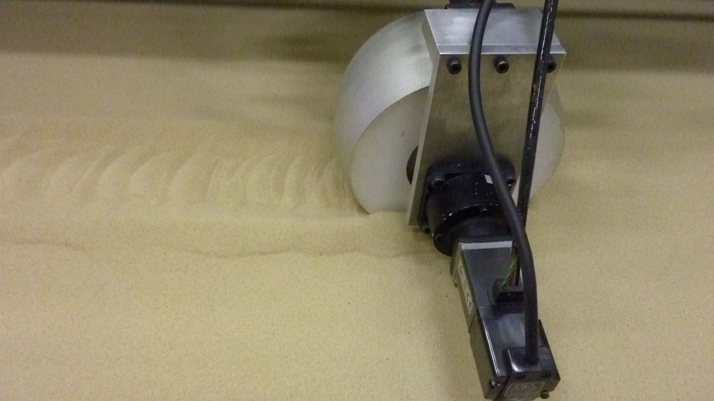
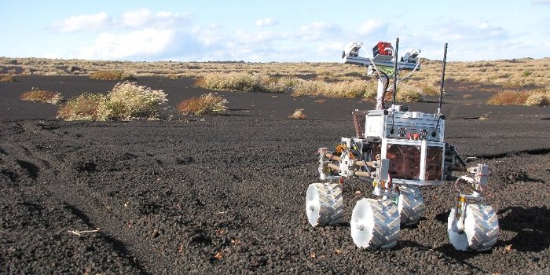

# ISTVS2024 | 21st International and 12th Asia-Pacific Regional Conference of the ISTVS

<figure><figcaption></figcaption></figure>

The conference is an opportunity to present and disseminate the latest scientific and technological achievements in the field of vehicle-terrain systems.

Both representatives of science in the field of mechanical engineering, vehicles and machines, mechatronics and automation, soil science, agriculture and environmental engineering, as well as professionals from industry, business environment and government agencies for whom the issues discussed at the conference are an important merit are invited to participate. The organizers also count on the participation of students from under- and postgraduate courses.

<figure><figcaption></figcaption></figure>

 

<figure><figcaption></figcaption></figure>

 

<figure><figcaption></figcaption></figure>

The intention of the organizers is to create a friendly atmosphere and comfortable conditions for holding plenary sessions. The conference includes the following thematic tracks:

* soil mechanical characterization
* off-road mobility modeling
* soil compaction
* driving systems of off-road vehicles and machines
* innovative concepts of tires, wheels, and tracks
* propulsion systems and engines
* vetronics
* autonomous and robotic systems
* metrology in terramechanics

**Prof. Junya Yamakawa**\
_Conference co-chair ::_ [_yamakawa@nda.ac.jp_](mailto:yamakawa@nda.ac.jp)\
[Automotive Engineering Laboratory | National Defense Academy](http://www.nda.ac.jp/cc/mech/en/automotive-engineering.html#faculty)

**Prof. Taizo Kobayashi**\
_Conference co-chair ::_ [_kobat@fc.ritsumei.ac.jp_](mailto:kobat@fc.ritsumei.ac.jp)\
[Dept. of Civil and Environmental Engineering | Ritsumeikan University](https://en.ritsumei.ac.jp/gsse/academics/researchers/article.html/?id=86)\

<figure><figcaption></figcaption></figure>

 

<figure><figcaption></figcaption></figure>

## Key dates

| Date                | Event                                                |
| ------------------- | ---------------------------------------------------- |
| **SUBMISSIONS**     |                                                      |
| February 15, 2024   | Abstract submission opens                            |
| March 15, 2024      | Abstract submission closes                           |
| March 31, 2024      | Notification of acceptance/rejection sent to authors |
| May 31, 2024        | Full paper submission                                |
| June 30, 2024       | Notification of peer review result sent to authors   |
| July 31, 2024       | Final paper submission                               |
|                     |                                                      |
| **REGISTRATION**    |                                                      |
| June 10, 2024       | Registration opens                                   |
| July 31, 2024       | Early bird registration closes                       |
|                     |                                                      |
| **PROGRAM**         |                                                      |
| July 1, 2024        | Preliminary program published                        |
| August 1, 2024      | Detailed program published                           |
| September 13, 2024  | Final program published                              |
|                     |                                                      |
| October 28-31, 2024 | Conference                                           |

<figure><figcaption></figcaption></figure>

<figure><figcaption></figcaption></figure>

<figure><figcaption></figcaption></figure>
