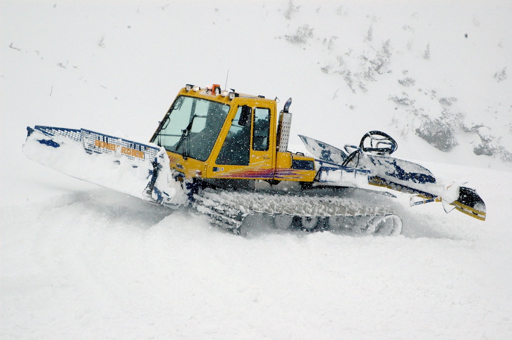
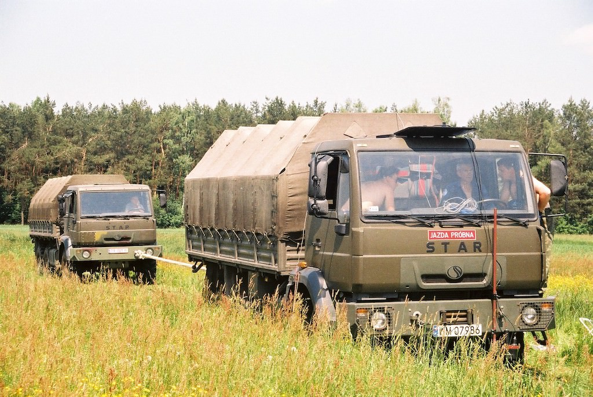

# 20th International and 12th Asia-Pacific Regional Conference of the ISTVS

The conference is an opportunity to present and disseminate the latest scientific and technological achievements in the field of vehicle-terrain systems.

Both representatives of science in the field of mechanical engineering, vehicles and machines, mechatronics and automation, soil science, agriculture and environmental engineering, as well as professionals from industry, business environment and government agencies for whom the issues discussed at the conference are an important merit are invited to participate. The organizers also count on the participation of students from under- and postgraduate courses.

<figure><figcaption></figcaption></figure>

 

<figure><figcaption></figcaption></figure>

 

<figure><figcaption></figcaption></figure>

The intention of the organizers is to create a friendly atmosphere and comfortable conditions for holding plenary sessions, focusing on the following issues:

* soil and other deformable traction substrates including Martian and lunar regolith, snow, moschus, etc., mechanical characterization for advanced field mobility modeling as well as for minimizing the effects of soil compaction and erosion, with particular emphasis on the impact of weather factors;
* driving systems of vehicles and machines, including innovative concepts of tires, wheels, and tracks for energy-saving traction;
* propulsion systems, engines, mechatronic systems, and vetronics to meet the high requirements of individual customers as well as increasingly stringent environmental protection standards;
* issues of regolith research of celestial bodies, the moon, Mars, asteroids for practical solutions in the field of mobility, autonomous, and robotic systems;
* metrology in terramechanics, in particular new solutions for remote, autonomous measurements, using AI and maintenance-free devices and systems;
* off-road vehicle dynamics;
* manned and unmanned vehicles including off-road robots;
* issues in the field of terramechanics and vehicle-terrain systems not mentioned above.

**Junya Yamakawa**\
_Conference chair ::_ [_yamakawa@nda.ac.jp_](mailto:yamakawa@nda.ac.jp)\
[Automotive Engineering Laboratory | National Defense Academy](https://www.mod.go.jp/nda/english/)

<figure><figcaption></figcaption></figure>

<figure><figcaption></figcaption></figure>

<figure><figcaption></figcaption></figure>

 

<figure><figcaption></figcaption></figure>

 

<figure><figcaption></figcaption></figure>

## Key dates

| Date               | Events     |
| ------------------ | ---------- |
| 28-31 October 2024 | Conference |

<figure><figcaption></figcaption></figure>
