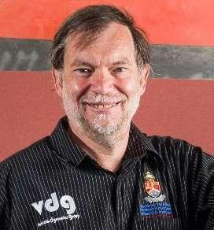

# Bekker-Reece-Radforth Award

The Bekker-Reece-Radforth Award was established in 2002 and honors exceptional research and/or industrial achievements in engineering practice of the principles of terramechanics. The award recognizes the exceptional contributions of Dr. M. G. Bekker, Dr. A. R. Reece, and Professor N. W. Radforth to the field of terramechanics and to the ISTVS.

***

## 2024 Bekker-Reece-Radforth Award Honoree

### Professor Schalk Els

Vehicle Dynamics Group\
Department of Mechanical and Aeronautical Engineering\
University of Pretoria\
Pretoria, South Africa

**Professor Schalk Els** founded the Vehicle Dynamics Group (VDG) within the Department of Mechanical and Aeronautical Engineering at the University of Pretoria in 1999. Under his leadership, the VDG has grown into a sustainable and widely-recognized research group comprising over 20 postgraduate students and seven staff members, with more than 60 alumni benefiting from his expert mentorship. His research prowess is evidenced by 148 publications listed on Google Scholar, accumulating nearly 3000 citations.&#x20;

Highlights of Professor Els's career include the development of a wheel force transducer widely utilized in off-road terrains, notably in successful tests with the US Army Corps of Engineers at their Cold Regions Research Engineering Laboratory (CRREL) and the Geotechnical & Structures Laboratory (GSL). He also pioneered the T2CAM, an innovative in-wheel, camera-based system capable of three-dimensionally measuring tire deformation across various terrains.&#x20;

Professor Els has been a dedicated member of ISTVS for years, playing an influential role in the society's journal and spearheading the 2012 ISTVS conference held in Pretoria, South Africa. His involvement dates back to the 1997 ISTVS conference in Ferrara, marking his initial contributions, with his first publication in the Journal of Terramechanics published in 1998. He has attended each ISTVS conference since the 2008 conference held in Turin. His exceptional achievements have been honoured with several best-paper accolades across different ISTVS conferences. Professor Els continues to embody a spirit of continuous learning, striving for technical excellence in the fields of off-road vehicle dynamics and tire-terrain interaction.&#x20;

His leadership in establishing and leading the VDG underscores his profound impact on the field. Profosser Els's pioneering work with the wheel force transducer and T2CAM exemplifies his dedication to advancing the understanding of tire-terrain interaction. His extensive publication record and significant citations underscore the influence of his research within academia and beyond. Furthermore, Professor Els's dedication to ISTVS is evident through his longstanding membership, editorial contributions, and successful conference organization, further illustrating his leadership in advancing global understanding of off-road vehicle dynamics.

<figure><figcaption></figcaption></figure>

ISTVS thanks the Vehicle Systems Development Corporation, Toronto, Ontario, Canada, for sponsoring the award this year.

> Vehicle Systems Development Corporation (VSDC) is based in Toronto, Ontario, Canada. The company specializes in the development of advanced vehicle mobility models, including the Nepean Tracked Vehicle Performance Model (NTVPM-85) and the Next-Generation Wheeled Vehicle Performance Model (NWVPM). VSDC collaborates with various defense and research organizations to enhance vehicle performance metrics and mobility solutions.

***

## Previous Honorees

<table data-column-title-hidden data-view="cards"><thead><tr><th>Year</th><th>Name</th><th>Affiliation</th><th data-hidden data-card-cover data-type="files"></th></tr></thead><tbody><tr><td>2021</td><td><strong>Dr. Sally Shoop</strong></td><td>Cold Regions Research and Engineering Laboratory, Hanover, NH, USA</td><td></td></tr><tr><td>2014</td><td><strong>Prof. Radhey Lal Kushwaha</strong></td><td>Professor Emeritus, University of Saskatchewan, Canada</td><td></td></tr><tr><td>2011</td><td><strong>Dr. Anders Bodin</strong></td><td>Alvis Hägglunds AB, Sweden</td><td></td></tr><tr><td>2008</td><td><strong>Yukio Nakajima</strong></td><td>Director of Engineering Tire Research Department, Bridgestone Corp., Japan</td><td></td></tr><tr><td>2005</td><td><strong>Mr. Robert D. Wismer</strong></td><td>Vice President, Deere &#x26; Company, USA</td><td></td></tr><tr><td>2002</td><td><strong>Mr. Alfons Falk</strong></td><td>Haegglunds Vehicle AB, Sweden</td><td></td></tr></tbody></table>

We thank Vehicle Systems Development Corporation, Toronto, Ontario, Canada, for sponsoring the award this year.

> Vehicle Systems Development Corporation (VSDC) is based in Toronto, Ontario, Canada. The company specializes in the development of advanced vehicle mobility models, including the Nepean Tracked Vehicle Performance Model (NTVPM-85) and the Next-Generation Wheeled Vehicle Performance Model (NWVPM). VSDC collaborates with various defense and research organizations to enhance vehicle performance metrics and mobility solutions.
