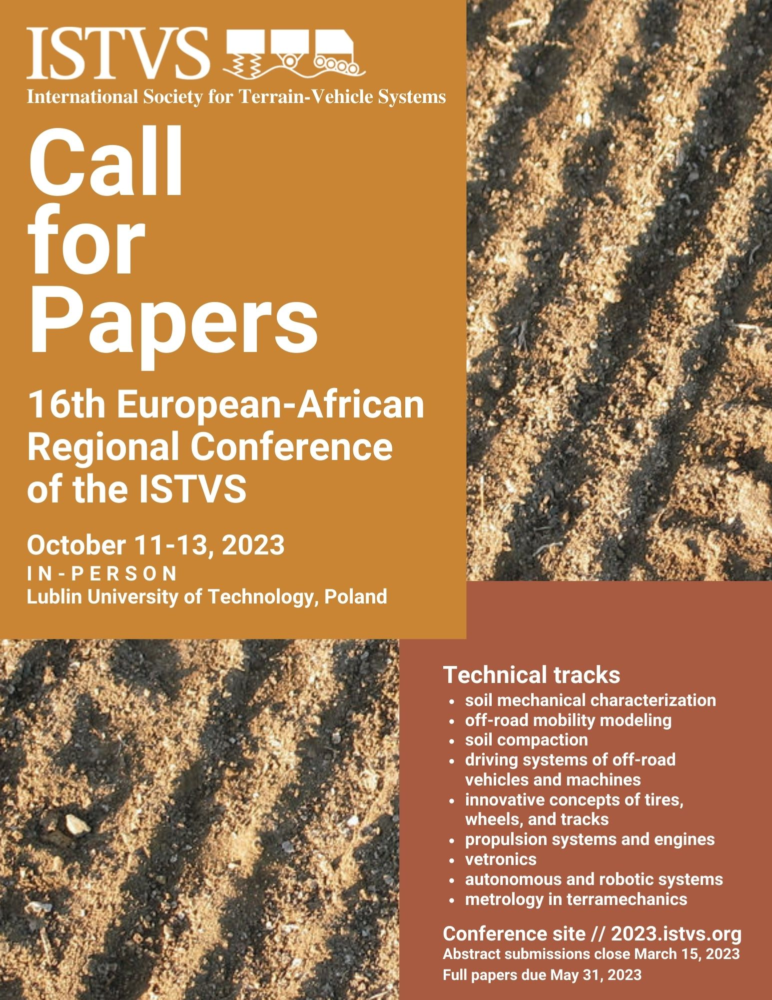
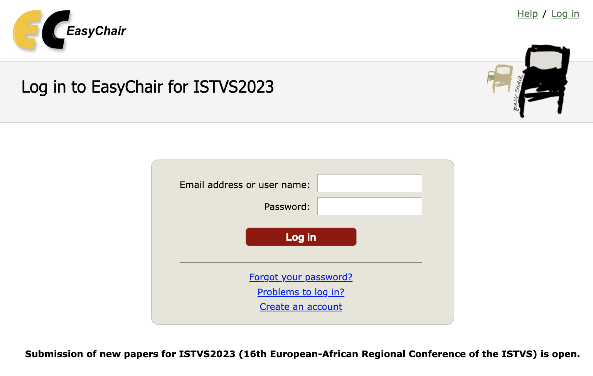

# Call for Papers

The 16th European-African Regional Conference of the ISTVS welcomes original and previously unpublished research and review papers describing results of research which are relevant to the conference topics and to terrain-vehicle systems.

* Authors wishing to make a submission are requested to submit an abstract by March 15, 2023.&#x20;
* Abstracts are requested to be under 1800 characters and must emphasize the objectives and results.&#x20;
* Authors may choose between two types of submissions: \
  full paper and abstract-only.&#x20;

All accepted submissions of either type will be included in the conference program for an oral presentation. Only full papers will be included in the conference proceedings. If your abstract is accepted, we strongly encourage you to submit a full paper in order to be included in the published proceedings.

**Review** // All abstracts will be reviewed by the conference Scientific Committee. Abstract acceptance will be notified to the corresponding author by March 15, 2023.

### **Technical tracks**

The conference includes the following thematic tracks:

* soil mechanical characterization
* off-road mobility modeling
* soil compaction
* driving systems of off-road vehicles and machines
* innovative concepts of tires, wheels, and tracks
* propulsion systems and engines
* vetronics
* autonomous and robotic systems
* metrology in terramechanics

<figure><figcaption></figcaption></figure>

### **Submission platform**

As in previous years, the conference submission platform is [EasyChair](https://easychair.org/conferences/?conf=istvs2023). If you’ve participated in a recent ISTVS conference, you will be able to log in with your existing account. If you’re new to ISTVS conferences, use the _Create an account_ link on the login page to get started. \
**Access here:** [**https://easychair.org/conferences/?conf=istvs2023**](https://easychair.org/conferences/?conf=istvs2023)

<figure><figcaption>
RrSubmissions login page for ISTVS 2023
</figcaption></figure>

### Copyright Assignment Form

Copyright assignment form is intended for original material submitted to conferences of the International Society for Terrain-Vehicle Systems (ISTVS) and must accompany any such material in order to be published by the ISTVS. Before publication of your paper in conference proceedings, the ISTVS must receive a completed and signed copy of this form sent via email to the conference chair.


ISTVS Copyright Assigment Form 2023.pdf


### **Templates**

All submissions must comply with the conference templates. Please carefully follow the guidelines provided. Right-click the links below to download:

Template for Abstract _// use_ [_EasyChair submission form_](https://easychair.org/conferences/?conf=istvs2023)\
Template for Full Paper _// posted 2023-04-18_


ISTVS\_paper\_template\_2023 combined .dotx and reference.pdf


_**REFERENCE PDFs**_\
_Provided for reference since live docs often open locally with broken formatting._

**Paper preparation** // Authors submitting a full paper must comply with the conference template and carefully follow the guidelines provided. Each full paper will be subject to peer review by reviewers selected by the Conference Scientific Committee. Each paper will be either accepted or accepted with revisions or rejected.

### **Presentation**

At least one author of a paper must attend the conference to present. If the full paper is not presented at the conference, it will not be included in the conference proceedings.


_Tue 2023-04-18 update_\
Paper template posted [below](call-for-papers.md#templates)



_Thu 2023-03-16 Update_\
Submissions deadline now extended to Thu 2023-03-30. [Submit here](https://easychair.org/conferences/?conf=istvs2023).



_Thu 2023-01-26 Update_\
Submissions open February 14, 2023. All authors are encouraged to submit full papers. Abstracts for oral presentations may also be submitted.

