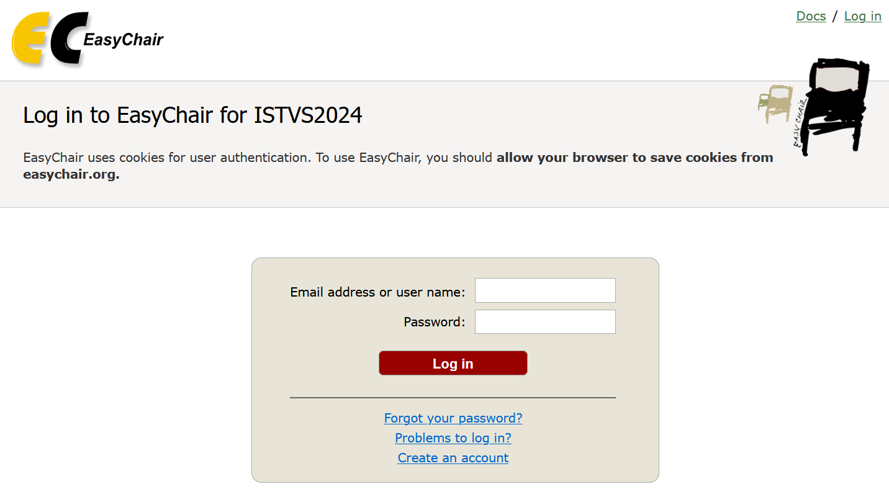

# Call for Papers


#### Copyright Assignment Form 

Copyright assignment form is intended for original material submitted to conferences of the International Society for Terrain-Vehicle Systems (ISTVS) and must accompany any such material in order to be published by the ISTVS.&#x20;

Before publication of your paper in conference proceedings, the ISTVS must receive a completed and signed copy of this form via the conference submission platform, EasyChair:

[ISTVS Copyright Assignment Form\_2024v1.pdf](https://files.gitbook.com/v0/b/gitbook-x-prod.appspot.com/o/spaces%2FDSUIEqgaPlFzlCt7TKJP%2Fuploads%2F4JevVzklzazZoDaOCXEv%2FISTVS%20Copyright%20Assignment%20Form\_2024v1.pdf?alt=media\&token=776ba519-537f-46ab-8787-f34bbdb8eec0)

\
**Author action required:**\
**Log in to EasyChair and click the icon on "View" column:**\
[**https://easychair.org/conferences/?conf=istvs2024**](https://easychair.org/conferences/?conf=istvs2024)\
**-> Click "Add or update files" on the upper left list.** \
**-> Attach the file on "Submission of COPYRIGHT ASSIGNMENT"**\
\
_2024-10-03 UPDATE_




_ISTVS2024_, the _21st International and 12th Asia-Pacific Regional Conference of the ISTVS_ welcomes original and previously unpublished research and review papers describing results of research which are relevant to the conference topics and to terrain-vehicle systems.

* Authors wishing to make a submission are requested to submit an abstract by **March 15**, 2024.
* Submission opens on **February 15**, 2024.
* Abstracts are requested to be under 1800 characters and must emphasize the objectives and results.
* Authors may choose between the following two types of submissions:\
  **full paper** and **abstract-only**.
* For either type of submission, authors can choose to do an **oral presentation** at the conference or submit a poster for the conference **poster session**.

**Abstract review** // All abstracts will be reviewed by the conference Scientific Committee.\
Abstract acceptance will be notified to the corresponding author by **March 31**, 2024.

**Full paper submissions** // After abstract acceptance, authors submitting a full paper must make their submission by **May 31**, 2024. Each full paper will be subject to peer review by reviewers selected by the conference Scientific Committee. Each paper will be either accepted, accepted with revisions or rejected; the decision will be notified by **June 30**, 2024. If a revision is requested, the revised paper must be submitted by **July 31**, 2024.

All accepted submissions of either abstract-only or full-paper type will be included in the conference program and will be published in the conference proceedings, on the condition that **at least one author attend the conference** to present the work. **Only full papers** will be assigned a **DOI** and will have a permanent individual page on the conference website; so, if your abstract is accepted, we strongly encourage you to submit a full paper to maximize the visibility of your work.

## Key dates

Key dates are listed [here](../../#key-dates).

## Technical tracks

The conference includes the following thematic tracks:

* soil mechanical characterization
* off-road mobility modeling
* soil compaction
* driving systems of off-road vehicles and machines
* innovative concepts of tires, wheels, and tracks
* propulsion systems and engines
* vetronics
* autonomous and robotic systems
* metrology in terramechanics

## CFP poster

You can view the Call for Papers poster [here](cfp-poster.md).

## Submission platform

As in previous years, the conference submission platform is [EasyChair](https://easychair.org/conferences/?conf=istvs2024). If you’ve participated in a recent ISTVS conference, you will be able to log in with your existing account. If you’re new to ISTVS conferences, use the _Create an account_ link on the login page to get started.\
Access here: [https://easychair.org/conferences/?conf=istvs2024](https://easychair.org/conferences/?conf=istvs2024)

<figure><figcaption>
Login page for the ISTVS2024 submission platform
</figcaption></figure>

## Submission guidelines

* Make sure that the authors you list in the _EasyChair_ form are **the same** as in your full paper and/or poster, and in the **same order**.
* Adopt the same **consistency** also for the **authors’ affiliations**.
* If at any time you need to make changes to the list of authors, please **promptly notify the conference organizers**.
* If the same authors appear in **multiple submissions**, please write the author **names** and **affiliations** in the **same way**, for **all submissions** (both in _EasyChair_ and in the papers/posters).
* If the latin alphabet is not your native alphabet, please make sure that you use the **same transliteration** for your name across all submissions (both in _EasyChair_ and in the papers/posters).
* If at any time - provided it's compatible with the conference organization schedule - you wish to **change your submission type** (abstract-only vs full paper) or **change your presentation type** (oral presentation vs poster session), please **promptly notify the conference organizers**.

## Templates for submissions

### Abstract

**No template** is required to submit your abstract.\
Submission is done directly on the [EasyChair](https://easychair.org/conferences/?conf=istvs2024) submission platform.

### Full paper

Papers must be submitted in _Microsoft Word_ format and must **comply with the conference template**.


ISTVS2024 paper template


The zip archive provided includes a **reference PDF**, in case the _Word_ document breaks when opened locally.

### Presentation

The following presentation template in _Microsoft PowerPoint_ format is provided for your convenience.


ISTVS2024 presentation template


**IMPORTANT:** The use of this template is **NOT** mandatory.\
If you choose to use your own template please maintain the **widescreen layout** and include **slide numbers**. We also recommend choosing a clean and clear layout.\
Whenever possible, aim for visual consistency throughout your presentation.

### Poster

A template and instructions for posters will be added to this page soon.

## Additional author resources

Additional author resources:

* copyright assignment form

will be added to this page as well, so keep an eye on it for updates.

