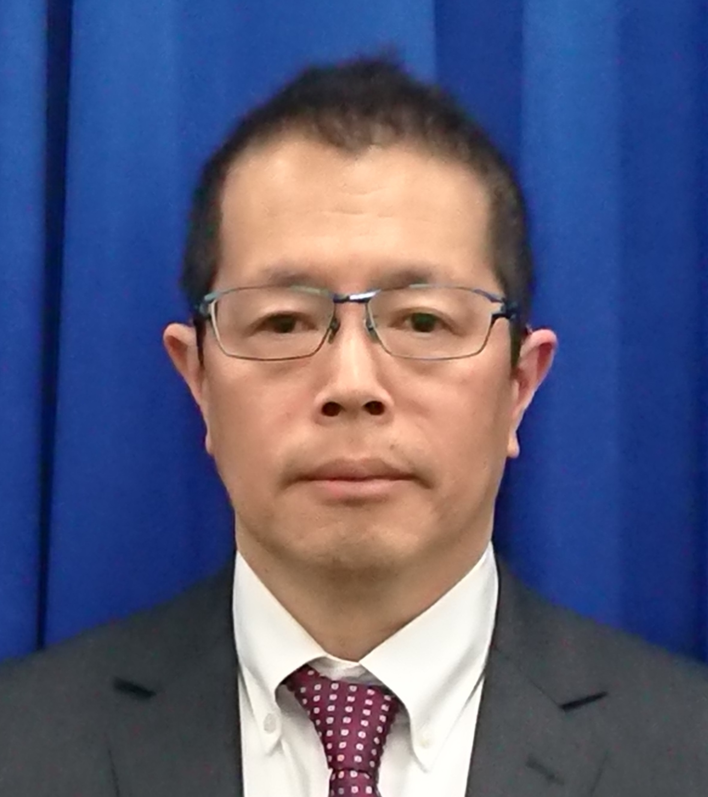

# Keynote

## Mr. Naoki Sato&#x20;

Senior Advisor, Pressurized Rover Engineering Center \
Human Spaceflight Technology Directorate \
JAXA (Japan Aerospace Exploration Agency)&#x20;

<figure><figcaption>
Mr. Naoki Sato, JAXA
</figcaption></figure>

Naoki Sato graduated Aeronautics Engineering Department, Kyusyu University in 1986, and gained master degree of applied engineering of Kyusyu University in 1988. At the same year, he entered in National Space Development Agency of Japan (predecessor of JAXA). Since 1990, he had been involved in the International Space Station program for about 16 years. After that, he started to work for the international space exploration program formulation. He is currently working as a senior advisor of the Pressurized Rover Engineering Center at JAXA.&#x20;

### Pressurized Rover as the Japanese Contribution to Artemis Program&#x20;

**Abstract** | Recognition of great success of International Space Station (ISS) program from the view of technology development and international relationship maturation, space agencies around the world started discussions for promoting this success toward the human space exploration beyond Low Earth Orbit (LEO) in early 2000’s. After long discussion and coordination among agencies, it was agreed to go to the moon first and demonstrate many technologies and operation, then go to the Mars. Especially, United States has begun Moon to Mars program, so called, Artemis program. Japanese government decided to participate in the Artemis Program in 2021, and then concluded an agreement with NASA to provide a Pressurized Rover (PR), and to get a right to send two Japanese astronauts onto the moon in 2024. The PR is like a camping car providing living environments with shirts sleeve and traversing capability on lunar surface for more than 10 years. Because the lunar environment is much harsh than LEO such as gravity, strong radiation, long night, dust, etc., the development of the PR is a huge challenge.
