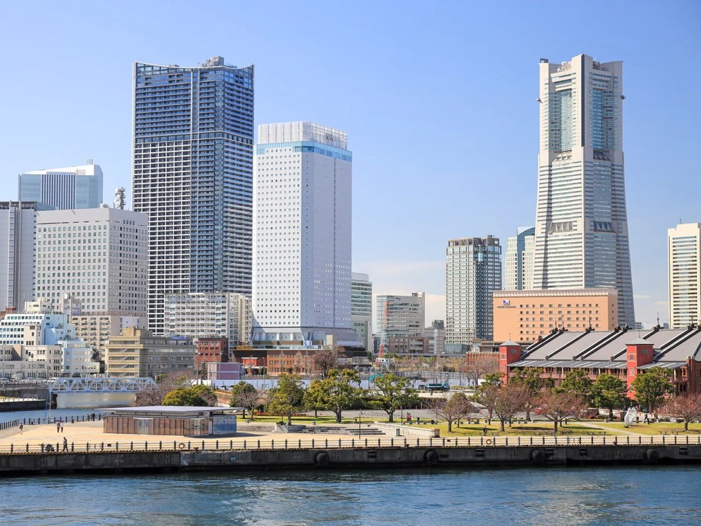
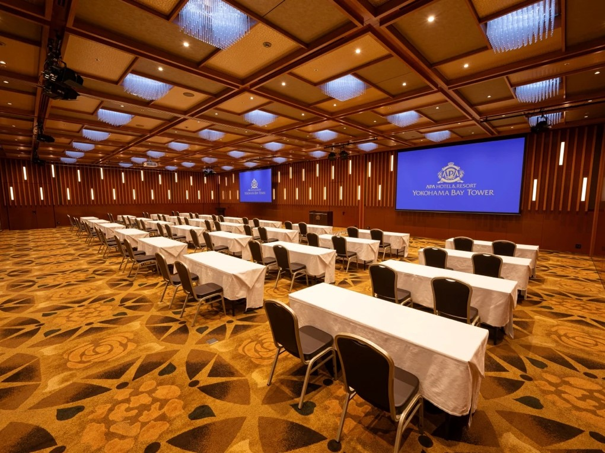
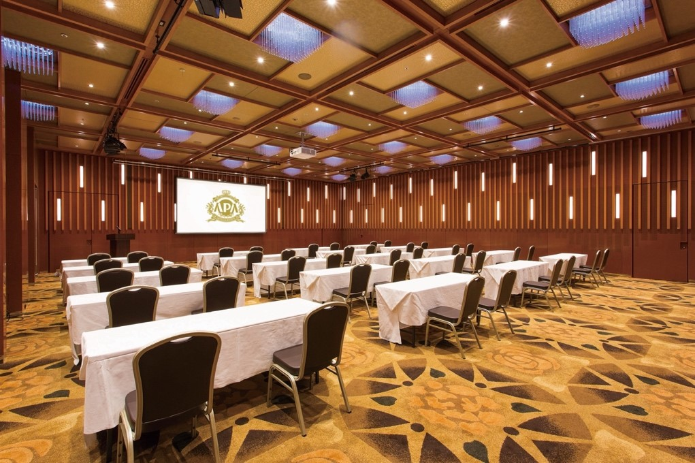

# Location and Travel

## Location

Yokohama Minato Mirai (harbor of the future), Japan.

<figure><figcaption></figcaption></figure>

### Yokohama

Japan’s second largest city.

Yokohama (横浜) is Japan's second largest city with a population of over three million. Yokohama is located less than half an hour south of Tokyo by train and is the capital of Kanagawa Prefecture.

Towards the end of the Edo Period (1603-1868), during which Japan maintained a policy of self-isolation, Yokohama's port was one of the first to be opened to foreign trade in 1859. Consequently, Yokohama quickly grew from a small fishing village into one of Japan's major cities.

[https://www.japan-guide.com/e/e2156.html](https://www.japan-guide.com/e/e2156.html)

### Minato Mirai

Yokohama’s new city center.

Minato Mirai 21 (みなとみらい 21) is a seaside urban area in central Yokohama whose name means "harbor of the future". It has many large high-rises, including the Landmark Tower, which was Japan's tallest building from 1993 until 2014. The area was a large shipyard until the 1980s, when development began to turn it into a new city center.

[https://www.japan-guide.com/e/e3200.html](https://www.japan-guide.com/e/e3200.html)

## Conference venue

APA HOTEL & RESORT YOKOHAMA BAY TOWER

### Room reservations

[https://www3.apahotel.com/hotel/shutoken/kanagawa/yokohama-bay-tower/](https://www3.apahotel.com/hotel/shutoken/kanagawa/yokohama-bay-tower/)

<figure><figcaption>
Conference room
</figcaption></figure>

<figure><figcaption>
Conference room
</figcaption></figure>
