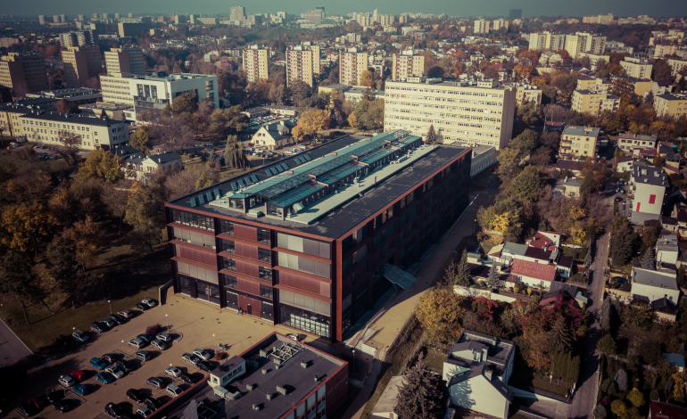

# Location

## Lublin University of Technology

[Lublin University of Technology](https://pollub.pl/) is the largest technical university in the region of eastern Poland. It has a 70-year tradition and consists of six faculties.



[The Faculty of Mechanical Engineering](https://wm.pollub.pl/) strives to carry out scientific research at the highest level, aimed at the needs of industry, enabling its employees and doctoral students to develop comprehensively, based on the best standards, equipment, tools and methods.

The mission of the Faculty of Mechanical Engineering is interdisciplinary education of students in a way that ensures the acquisition of knowledge and skills to create creative solutions, in conjunction with science, technical development, in cooperation with the economy and society and in accordance with the best international standards and the level of modern civilization.

<figure><figcaption>
Lublin University of Technology
</figcaption></figure>

## Lublin

Here is some information about the city:

* [Young at heart: Poland’s party city of Lublin | Poland holidays | The Guardian](https://www.theguardian.com/travel/2023/jul/01/young-at-heart-polands-party-city-of-lublin-european-youth-capital)
* [European Youth Capital 2023](https://lublin.eu/en/lublin/youth-lublin/)
* [Carnaval Sztukmistrzów | Edition 2022 - YouTube](https://www.youtube.com/watch?v=opvoK6hBqrY)

## Travel to Lublin, Poland

* Air transfer through Warsaw (general international connections), Rzeszów, and Cracow (south connections) or directly to Lublin Airport, [https://www.lot.com](https://www.lot.com)&#x20;
* Transfer from Warsaw: by train (approx. 2h30m) [https://www.intercity.pl/en/](https://www.intercity.pl/en/), by coach (approx. 2h), [https://www.flixbus.pl](https://www.flixbus.pl), [https://www.busradar.pl](https://www.busradar.pl)

## Public transport in Lublin

* Modern public transport network, electric buses, convenient connections
* Individual transport: taxi, Uber, Bolt, electric scooter network
* Rental cars: [https://www.rentalcars.com](https://www.rentalcars.com/pl/city/pl/lublin/?affiliateCode=ggle\&preflang=pl\&label=lublin-m\_4RTyPMwzVDRay8MGD73QS263768963943\&ws=\&ppc\_placement=\&ppc\_target=\&ppc\_param1=\&ppc\_param2=\&aceid=\&adposition=\&ppc\_network=g\&feeditemid=\&ppc\_targetid=kwd-115099250687\&loc\_physical\_ms=9067423\&loc\_interest\_ms=\&ppc\_device=c\&ppc\_devicemodel=\&gclid=Cj0KCQiAlKmeBhCkARIsAHy7WVuWg3MGZFVvGopqss3yPP2T9zrduGqwZTdHOcahCoAU7UrvUREk1\_gaAt25EALw\_wcB), [https://www.ipanek.pl](https://www.ipanek.pl), [https://www.kayak.pl](https://www.kayak.pl)&#x20;

## Hotel information—selected hotels

_Times given in walking distance from conference venue_

Hotel Victoria Lublin, 10 min.\
[https://victorialublin.pl/](https://victorialublin.pl/)

IBB Grand Hotel Lublin, 15 min.\
[https://ibbhotellublin.com/](https://ibbhotellublin.com/)

Hotel Mercure Lublin, 20 min.\
[https://mercure-lublin-centrum-hotel.at-hotels.com/pl/](https://mercure-lublin-centrum-hotel.at-hotels.com/pl/)

<mark style="color:orange;">**Gala dinner venue:**</mark> Ibis Styles Hotel Lublin, 20 min.\
[https://ibislublin.pl/hotel/o-hotelu](https://ibislublin.pl/hotel/o-hotelu)

<figure><figcaption>
Gala Dinner Venue
</figcaption></figure>
