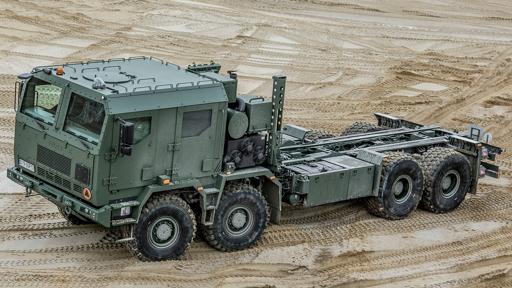

# Technical tour

The 2023 16th European-African Regional Conference of the International Society for Terrain-Vehicle Systems (ISTVS) will conduct a technical tour at [the Military Institute of Armored and Automotive Technology (MIAAT)](https://witpis.pl/english-2/witpis-home-cloned/) located at the Sulejówek, near Warsaw.

The tour will include a short presentation, visiting outdoor laboratories, and a presentation of test stands and vehicles. The tour will be followed by a visit to [Kazimierz Dolny](https://www.kazimierz-dolny.pl/), with an opportunity for sightseeing and dinner in a restaurant.

<figure><figcaption></figcaption></figure>

> The Military Institute of Armored and Automotive Technology (MIAAT) is a facility where research and development projects are conducted to improve the quality and functionality of vehicles, military equipment and armaments of the Polish Army.

<figure><figcaption>
SANP
</figcaption></figure>

 

<figure><figcaption>
BORSUK
</figcaption></figure>

> MIAAT conducts research and tests of vehicles implemented in the Polish Armed Forces and participates in the process of their modernization. Meeting the growing demand for new technologies, the Institute is involved in research, the results of which carry considerable potential for implementation and innovation. Performing work in the area of research, development and implementation of military and civilian equipment, the Institute participates in many key R\&D project on a national and international scale.
>
> The Institute has three accredited laboratories, a Product Certification Unit, an Expert Office and, above all, qualified staff, which allows to cooperate with many universities in terms of research projects, joint publications and the development of scientific staff.\
> \- MIIAT website

### Schedule for October 13, 2023

7.30 Departure from Lublin\
10.00 Arrival at [MIAAT Sulejówek](https://witpis.pl/english-2/witpis-home-cloned/)\
10.15 Welcome by MIAAT officer and a short presentation of the programme\
10.20 Presentation of the Institute (indoor)\
10.35 Presentation of the laboratories (outdoor/indoor, talk to test engineers/researchers)\
11.30 Test-show of military vehicles: Jelcz, Tareo, Rosomak (outdoor, in action)\
13.00 Refreshment (Military pea soup + coffee/tea)\
13.30 End and farewell to the participants of the trip\
14.00 Departing from Sulejówek\
15.30 [Kazimierz Dolny](https://www.kazimierz-dolny.pl/), lunch in a restaurant\
16.00 Visiting Kazimierz Dolny\
18.00 Departing for Lublin

### Registration details

_Registered conference attendees:_ the cost to attend the technical tour is already **included** in the conference registration fee.

_Registered accompanying guests_: must book the tour **separately** (see details in [**Registration**](registration.md))

In either case, not later that **Friday, 15 September 2023**, you must submit the dedicated **registration form** (below), uploading a scan of a valid **identity document**, so that the necessary background checks can be carried out.

Accepted identity documents are:

1. Polish and EU citizens: National Identity Card or Passport.
2. Non-EU citizens: Passport.

Please take notice of the following:

1. **Attendees who do not submit all the required information within the given deadline will not be authorized to attend the tour.**
2. **Final authorization is dependent on successful background checks.**
3. **The MIAAT reserves the full right to reject any technical tour registration request.**

#### Technical Tour Additional Information&#x20;

The technical tour to MIAAT facilities will take place on Friday, 13 October 2023.&#x20;

Registered tour attendees will meet outside (east gate) the RUSTY-Building on the campus of the Lublin University of Technology at 7:15 and board buses for transportation to MIAAT facilities. Buses depart from RUSTY promptly at 7:30.&#x20;

Upon completion of the tour at MIAAT, the buses will transfer attendees to Kazimierz Dolny for lunch and visiting the city. After visiting Kazimierz Dolny, buses will return attendees to Lublin, finishing the ride at RUSTY-Building of the LUT.

### Registration form

_Note: scroll to show Register button again after uploading your image._&#x20;




_Note that you will not receive a confirming tour registration email._

