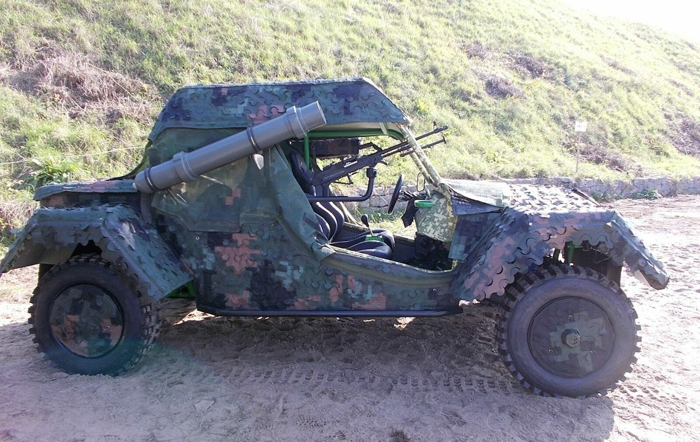
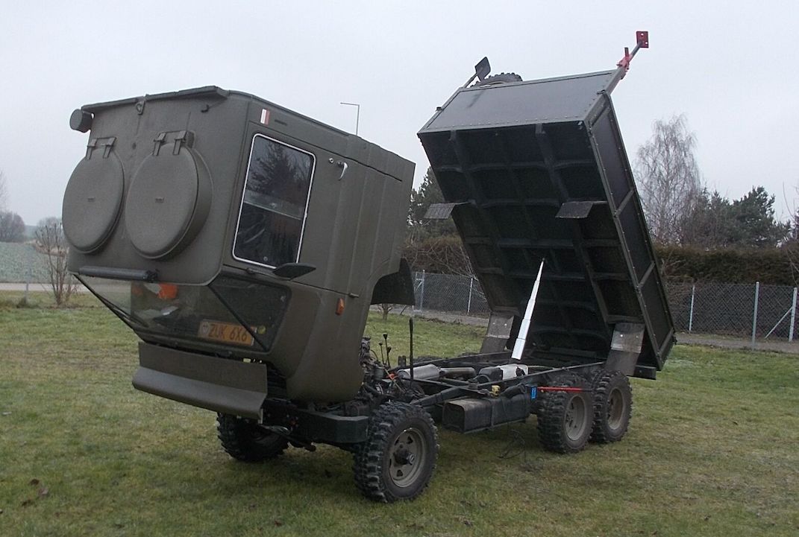
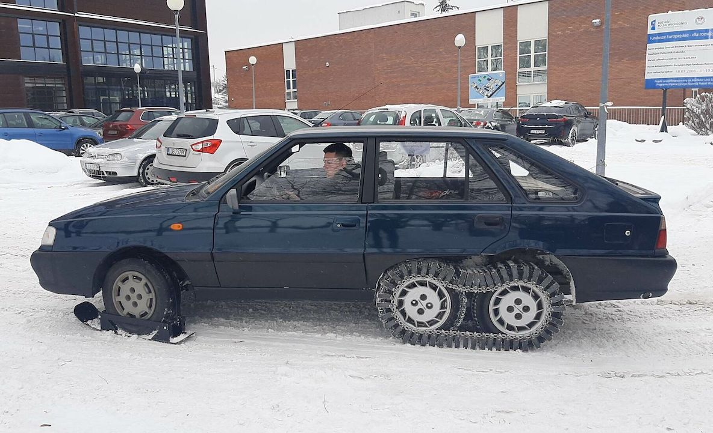
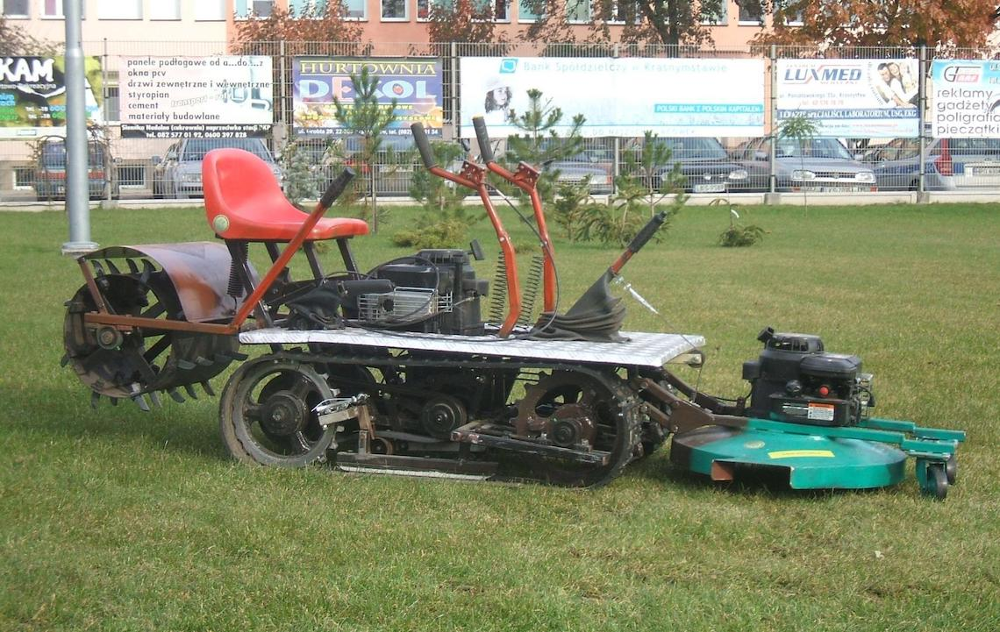
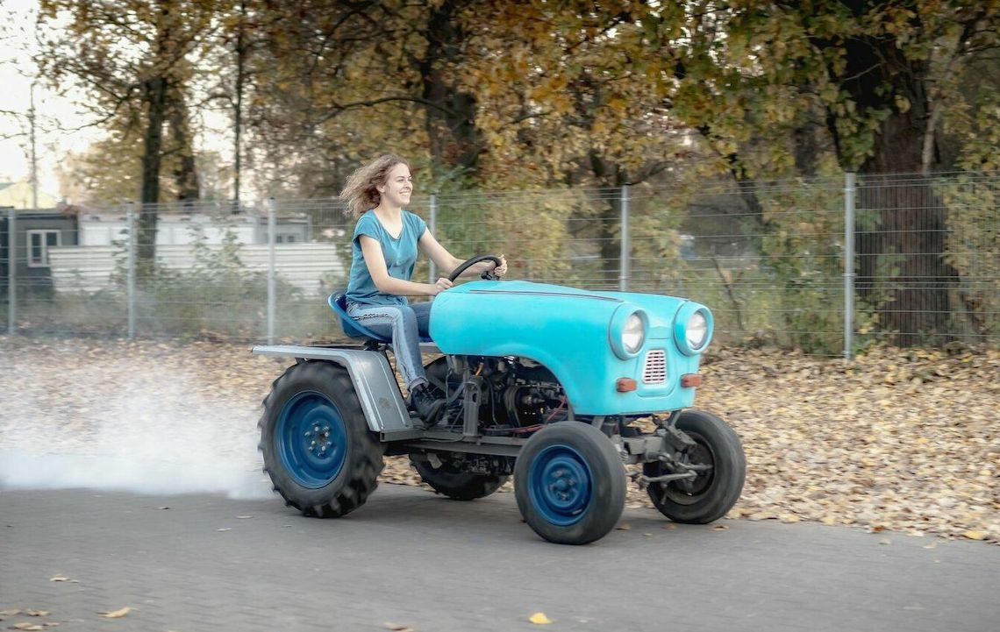
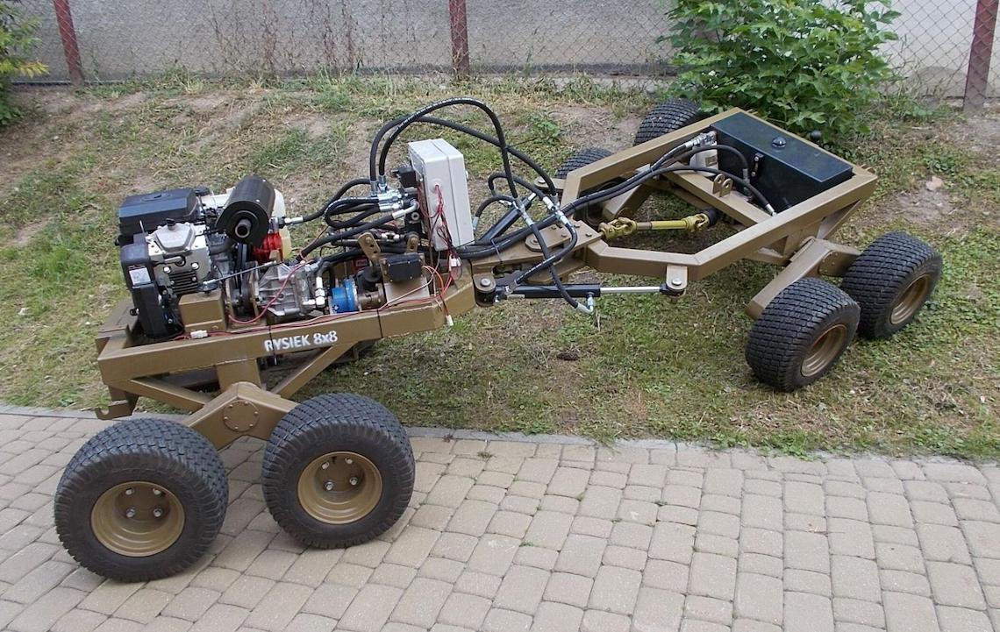

# Student projects

Among numerous student technical groups at the Lublin University of Technology, there is the Student Group of Materials Engineering, led by Prof. Leszek Gardyński, who is also a great enthusiast of off-road and military vehicles. Prof. Gardyński, together with students of mechanical engineering, create designs for various off-road vehicles and machines. Selected projects are presented below. All of these vehicles will be available to conference attendees on October 11. The presentation of these vehicles will be located at the main entrance to the RUSTY building. Students who participated in the construction will be present with each vehicle and will be happy to explain the details to the conference attendees. From 5.00 PM there will be a presentation of the vehicles, during which they will be launched and presented in action.

More information on individual vehicles can be obtained through the chair of the conference, Jarosław Pytka [j.pytka@pollub.pl](mailto:j.pytka@pollub.pl)

<figure><figcaption>
<strong>BUGGY 4x4.</strong> A prototype of a light off-road vehicle with improved trafficability and versatile use proposed by the Lublin University of Technology for the army and public order services.
</figcaption></figure>

 

<figure><figcaption>
<strong>ŻUK 6x6.</strong> A small tipper with all-wheel drive and the possibility of configuring the drive 6x2, 6x4, and 6x6. Has a cab that opens like in larger trucks and other improvements for off-road use.
</figcaption></figure>

<figure><figcaption>
<strong>HYBRID POLONEZ</strong> Students installed an additional axle. Steel tracks are mounted on the wheels of the two rear axles and skids on the front axle wheels, thanks to which the vehicle is able to overcome snowy areas.
</figcaption></figure>

 

<figure><figcaption>
<strong>Tracked mower.</strong> A small mower with a tracked running gear and equipped with two motors, one to drive the tracks, the other to drive the mowing knives.
</figcaption></figure>

<figure><figcaption>
<strong>TRABAKTOR Zbyszek.</strong> A nice and very practical tractor based on parts from Trabant and Polonez cars among others.
</figcaption></figure>

 

<figure><figcaption>
<strong>RYSIEK 8x8.</strong> A remotely controlled off-road platform based on the idea of ​​Ryszard Pluciński from Podhale, Poland. An articulated vehicle that can be used for a variety of purposes.
</figcaption></figure>

<figure><figcaption>
<strong>RUDY 105B.</strong> A ​​universal tracked vehicle of 1 tonne class. Various superstructures can be mounted on the vehicle. Currently, presented adapted and rebuilt into a military off-road style with a Syrena 105 Bosto body.
</figcaption></figure>
